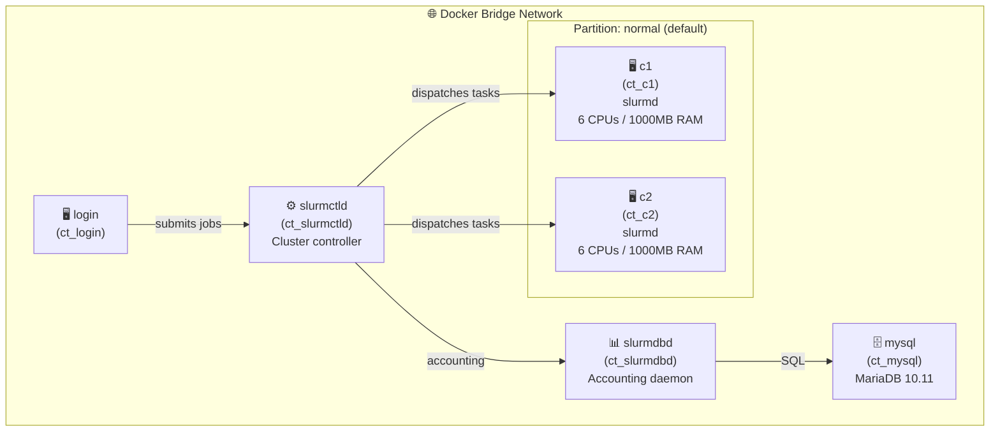

# Setup of the mock Slurm HPC environment

## Requirements

- docker
- git

## Clone this repo

```bash
git clone https://github.com/pasqal-io/slurm-qrmi-warden-hpc-training.git pasqal_training
cd pasqal_training/hands-on
```

## The Slurm Docker Cluster

We will work within a Slurm cluster deployed across docker containers. 
The `docker-compose.yaml` file describes this toy slurm cluster:



Several directories are shared across some nodes for ease of use:
- Across all nodes:
    - `/etc/munge`
    - `/etc/slurm`
- Across `login` and compute nodes (`c[1-2]`)
    - `/home/slurmuser`

Some directories are mounted from the host to the slurm cluster, also for convenience:
- Across all nodes:
    - `./qrmi_config.json` on `/etc/slurm/qrmi_config.json`
    - `./plugstack.conf` on `/etc/slurm/plugstack.conf`
- Across `login` and compute nodes (`c[1-2]`)
      - `./scripts` on `/home/slurmuser/scripts`

## Build the cluster

```bash 
docker compose up --build -d
```

You can see the slurm logs from the cluster by running:

```bash
docker compose logs -f 
```

## Connect to the cluster

You can "connect" to the cluster's login node with this script:

```bash
./login.sh
# Check that Slurm is running
sinfo
```

Check that the nodes are indeed in the same network as the login node:

```bash
ping c1
ping c2 
ping slurmctld
```

### Hello, World

We can run a simple hello world sbatch to test that the cluster is working:

```bash
sbatch scripts/helloworld.sh
```
And get the output in `data/hello_*.out`

```
Hello, World!
```

Everything is working !
