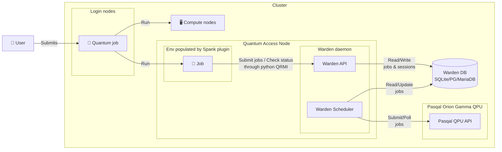

# Installation of the stack

The next steps will take place inside the slurm docker cluster environment.

To connect to the cluster login node: 

```bash
cd ./hands-on
./login.sh
# Check that Slurm is running
sinfo
# Check that munge is installed and running
munge -n
```

Checkout the information encoded by munge:

```bash
munge -n | unmunge
```

You are logged-in as `slurmuser` but note that you have sudo permissions:

```bash
sudo echo "hello"
```

You are now good to go !

## Spank plugin

### Installation

Build Spank plugin from source:

```bash
cd $HOME
wget https://github.com/qiskit-community/spank-plugins/archive/refs/tags/v0.6.3.tar.gz
tar -xvzf v0.6.3.tar.gz
cd spank-plugins-0.6.3/plugins/spank_qrmi
mkdir build
cd build
cmake -DENABLE_MUNGE=ON -DQRMI_GIT_TAG=v0.13.4 ..
make
# move built .so file 
sudo mkdir -p /etc/slurm/plugins
sudo mv spank_qrmi.so /etc/slurm/plugins/
cd $HOME
```

### Configuration

Edit `/etc/slurm/qrmi_config.json` (or `hands-on/qrmi_config.json` locally which is mounted to `/etc/slurm/qrmi_config.json`) to add the following configuration:

```json:qrmi_config.json
{
  "resources": [
    {
      "name": "PASQAL_LOCAL",
      "type": "pasqal-local",
      "environment": {
        "QRMI_URL": "http://localhost:8006"
      }
    }
  ]
}
```

This configuration is how we define access for the `PasqalLocal` QRMI implementation:
- When a user requests the `--qpu=PASQAL_LOCAL` option, the spank plugin will try to acquire the QPU resources from a `pasal-local` type of QRMI resource parametrized with the options defined in `"environment"`
- The `QRMI_URL` should point to the Warden API on the QAN ([from the qrmi docs](https://github.com/qiskit-community/qrmi/tree/main/examples/qrmi/python/pasqal_local))

The spank plugin is configured to acquire the QPU resource at the start of a job. The plugin uses 

Edit `/etc/slurm/plugstack.conf` (or `hands-on/plugstack.conf` locally) to add the `spank_qrmi` plugin and pass it the `qrmi_config.json` configuration file:

```
optional /etc/slurm/plugins/spank_qrmi.so /etc/slurm/qrmi_config.json
```

### Reconfigure Slurm

We now need to enforce the changes that we just made, meaning registering the `spank_qrmi` plugin using the `qrmi_conf.json` configuration.

To do so, reconfigure slurm:

```bash
sudo scontrol reconfigure
```

You should see a new option for the `sbatch` command appear: `--qpu`:

```bash
sbatch --help | grep qpu
```

## User QRMI

While the Spank plugin has it's own version of the qrmi installed, users also need to interact with the QPU resources through the QRMI and need a version installed in their personal env.

### Create a venv

We need to create a python venv that we will use to install our python dependencies that we will use in our `sbatch` jobs

```bash
python3 -m venv ~/venv
```

### Compile QRMI from source

```bash
cd $HOME
git clone https://github.com/qiskit-community/qrmi.git
cd qrmi
git checkout 0.15.0
cargo clean
# Source our python venv
source /home/slurmuser/venv/bin/activate
pip install -r requirements-dev.txt
# We configure the compilation to have munge support
CARGO_TARGET_DIR=./target/release/maturin maturin build --release --features pyo3/extension-module,munge,pyo3/abi3,qrmi/pyo3
pip install "$(find target/release/maturin/wheels/ -maxdepth 1 -regex '.*whl')[pasqal]"
# Check Installation
pip show qrmi
pip show pulser
```

> [!Note]: 
> For the moment we need to compile the QRMI from source to ensure `munge` support. In the future we will be able to install it from PyPI like `pip install qrmi[pasqal]`

## Warden middleware

Warden is the daemon interfacing between the user using the QRMI and the PasqalQPU.

We install it on a compute node dedicated to access the Pasqal QPU that we call the Quantum Access Node (QAN):



For this tutorial, we will use the `c1` compute node as the *QAN*. 

### Connect to the QAN

For the following steps, we will be working on the `c1` QAN node to install warde,. 

To login the docker container from your laptop: 

```bash
cd hands-on
./login_c1.sh
```

### Installation

The Warden middleware is [open-source](github.com/pasqal-io/warden) and can be installed from source.

The repository provides a quick install script:

```bash
curl -fsSL https://raw.githubusercontent.com/pasqal-io/warden/refs/heads/main/install.sh | WARDEN_VERSION=main bash
```

When prompted, set the installation path to somewhere `slurmuser` has write access - e.g. `/home/slurmuser/warden` - and accept the default configuration.

Check that `warden` was installed correctly:

```bash 
cd <warden_installation_path>
make run
```

### Configure

Warden is mainly configured through a `config.yaml` file. Any edit to this file needs warden to be restarted.

The most critical parameter to adjust is the uri to Pasqal's QPU API. In production context, this parameter will need to be setup to point to the actual QPU. 

It can be set either:
- By editing the `qpu.uri` parameter in the `config.yaml` file.
- By setting the `WARDEN_QPU_URI` env variable

For now we can leave it to the default value `http://localhost:8000`.

| Note that env variables take higher precedence over the `config.yaml` file

You can also set the host and port of the Warden API:
- By editing the `api.host` and `api.port` parameters in the `config.yaml` file
- By setting the `WARDEN_API_HOST` and `WARDEN_API_PORT` env variables.

To see more information about Warden's configuration, checkout the [`README.md`](https://github.com/pasqal-io/warden) file.

### Database

Here we are running the default Sqlite database backend. By default a `warden.db` db will be created at the root of the repo . 

Other available database backends are:
- Postgresql
- MariaDB

We will not demonstrate them in this tutorial, but feel free to read the documentation to learn more on how to configure Warden on different db backends.

### Run 

For testing purposes, Warden comes packaged with a mock api that simulates the behavior of an actual Pasqal QPU.

We will run it on the same node as Warden for ease of configuration.

By default the Warden configuration expects the QPU API (`WARDEN_QPU_URI`) to be located at `localhost:8000`. So we make sure to set the right port when starting the mock API

To launch the mock api, run the following command in a dedicated terminal:

```bash 
UVICORN_PORT=8000 make start-qutip-qpu
```

> [!Note]
> This mock API also comes packaged with an emulator for quantum programs based on [`QuTiP`](https://qutip.org/)

We can now launch the Warden daemon in an other dedicated terminal 

```bash
make run
```

To check that the Warden daemon is running correctly, you can ping it:

```bash
make ping
```

To check that the Warden daemon is correctly connected to the mock api, we can call this Warden endpoint:

```bash
curl localhost:8006/qpu/specs
```

This command should return the specs of the QPU supposedly running behind the mock QPU we just deployed.


### Deploy

In a standard environment we would deploy Warden using a `systemctl` service. However in our toy docker environment, setting-up `systemctl` is a bit tricky.

For the rest of the tutorial, leave `warden` and the mock qpu api running in their dedicated terminal.

# Test the stack

Once you have installed:
- Warden on the QAN
- The spank plugin
- The user QRMI

We are good to go and demonstrate how the stack works.

Connect to the login node:
```bash
cd ./hands-on
./login.sh
```

> [!Note]
> We mounted the `hands-on/scripts` dir to `$HOME/scripts` inside the cluster

## Env population by spank plugin

The `test_env.py` is a simple python script that prints the environment variables during execution. This will be helpful to demonstrate how the spank plugin interacts with Warden and prepares the execution environment for user scripts that use the QRMI.

### Sbatch script

Edit `scripts/job.sh` to run the `test_env.py` script

### Run

Connect on the login node

```bash
./login.sh
```

And run the script:

```bash 
sbatch scripts/job.sh
```

### Results

Note that the spank plugin automatically created a new warden session:

And in the output of the job (`$HOME/data/job_<id>.out`) you can see the `QRMI_*` environment variables populated from the `qrmi_config.json` file:
- `PASQAL_LOCAL_QRMI_URL`: pointing to the Warden API uri
- `SLURM_JOB_QPU_RESOURCES`: `PASQAL_LOCAL`: which QRMI to load

And the `PASQAL_LOCAL_*` specific env variables:
- `PASQAL_LOCAL_QRMI_JOB_ACQUISITION_TOKEN`: Warden session token

Indeed when you look at the Warden logs (`path/to/warden/logs/warden.log`) you can see that even though we did not run any quantum job though the QRMI we have logs. During the init of the task, the spank plugin checked the accessibility of Warden and created a new session which was closed by the plugin during the epilog:

```
# Job init
[YYYY-MM-DD hh:mm:ss] INFO uvicorn.access: 127.0.0.1:46812 - "GET /accessible HTTP/1.1" 200
[YYYY-MM-DD hh:mm:ss] INFO uvicorn.access: 127.0.0.1:46812 - "POST /sessions HTTP/1.1" 200
# Job epilogue
[YYYY-MM-DD hh:mm:ss] INFO uvicorn.access: 127.0.0.1:46820 - "DELETE /sessions/<PASQAL_LOCAL_QRMI_JOB_ACQUISITION_TOKEN> HTTP/1.1" 200
```

We can also look at the spank logs on the compute node (`c1`). For that we need to connect to the `c1` node:

```bash
./login_c1.sh
```

And look at `/var/log/slurm/slurmd.log`: 

```bash
sudo cat /var/log/slurm/slurmd.log
```

Here are some of the interesting information you can gather from the debug spank logs:

Parsing the user option:
- `spank_qrmi: --qpu=[PASQAL_LOCAL]`

Finding the corresponding configuration in `qrmi_conf.json`
- `spank_qrmi: name(PASQAL_LOCAL)`

Propagating the corresponding environemnt
- `spank_qrmi: setenv(PASQAL_LOCAL_QRMI_URL, http://localhost:8006)`

The spank plugin acquired the QPU resource through Warden by creating a session:
- `spank_qrmi: acquisition_token: <TOKEN>`

The Spank plugin passes the token to the user environemnt variable
- `spank_qrmi: setenv(PASQAL_LOCAL_QRMI_JOB_ACQUISITION_TOKEN, <TOKEN>)`

At the end of the job, the Spank plugin releases the computing resources by deleting the session:
- `spank_qrmi: releasing name(PASQAL_LOCAL), type(4), token(<TOKEN>)`

## Basic Quantum job with the QRMI

The `test_pulser_qrmi.py` script allows users to run a quantum job through the QRMI using Pasqal's [Pulser SDK](https://docs.pasqal.com/pulser/).

> [!Note]
> We will get into more details later

### Sbatch script

Edit `scripts/job.sh` to run the `test_env.py` script

### Run

Connect on the login node

```bash
./login.sh
```

And run the script:

```bash 
sbatch scripts/job.sh
```

### Results

From the output of your job in `$HOME/data/` you should see the output of your quantum job:

```
results (SampledResult(atom_order=('q0', 'q1', 'q2', 'q3'), meas_basis='ground-rydberg', bitstring_counts={'0000': 471, '0100': 9, '0010': 6, '1000': 8, '0001': 6}, evaluation_time=1.0),)
```

With your "histogram" output in `bitstrin_counts`.

And from your Warden logs, either in the stdout or `/path/to/warden/logs/warden.log`

```
...
Created Warden job N from slurm job <SLURM_JOB_ID>
...
Job created on QPU
...
Job N ended with status DONE
...
```

*Do you have any needs regarding the format of the warden logs ?*

All good ! Everything works

